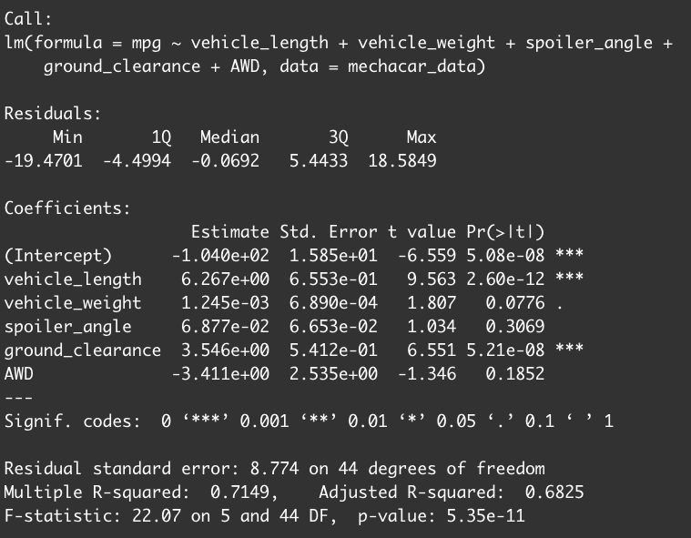

# MechaCar_Statistical_Analysis

## Linear regression to Predict MPG

* Variables that provided non random amount of variance: vehicle_length, ground_clearance
* Slope of the linear model
  * Not equal to zero
  * p-value is 5.35e-11, smaller than the significance level
* Does it predict the MechaCar protypes effectively? 
  * Yes the R-squared was .7149 which means it does a decent job just not the best
  
  

## Summary Statistics on Suspension Coils
Lot 1 and 2 meet the design specs with a variance of .9 and 7.4.They also have identical means and median. On the other hand, lot 3 far exceeds the specifications but with all 3 combined the variance is within range.
Summary by Lot | Total Summary
:-------------------------:|:-------------------------:
|

